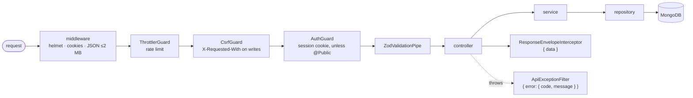
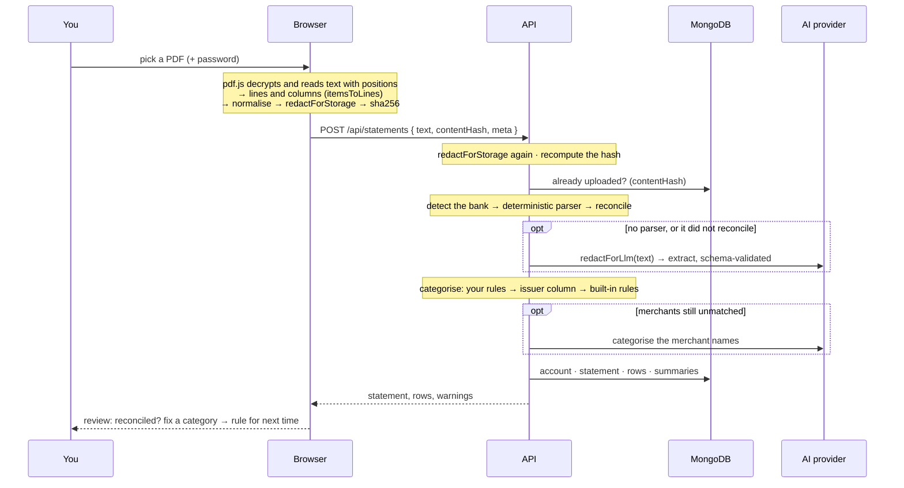
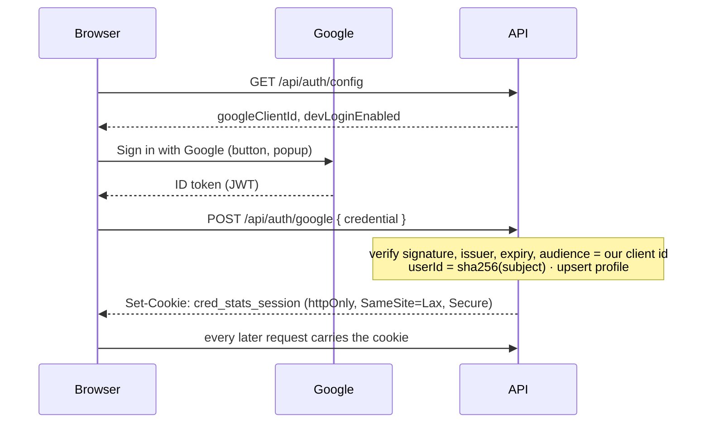

# Architecture

Three npm workspaces and one rule about where code runs:

| Package                              | Runs in     | Holds                                                                                                                                            |
| ------------------------------------ | ----------- | ------------------------------------------------------------------------------------------------------------------------------------------------ |
| `shared/` — `@cred-stats/shared`     | both        | zod schemas for every entity and API payload, money, categories, period arithmetic, display formatting, the statement-text format, **redaction** |
| `backend/` — `@cred-stats/backend`   | Node        | the NestJS API: auth, the bank parsers, ingest, persistence, the AI providers                                                                    |
| `frontend/` — `@cred-stats/frontend` | the browser | the React app: PDF extraction and redaction, upload, the dashboards                                                                              |

`shared` may not touch Node, the DOM or the network. The backend and frontend
never import each other; they meet only through the types in `shared`.

---

## Backend

NestJS 12 (ESM), laid out by layer. Every class is listed in one file,
`backend/src/providers-and-controllers.ts`, so what the app is made of is
readable in one place.

| Folder                                | Layer              | Rule                                                            |
| ------------------------------------- | ------------------ | --------------------------------------------------------------- |
| `controllers/`                        | HTTP               | validate input (zod pipes), call one service, return plain data |
| `services/`                           | business logic     | no HTTP, no MongoDB queries                                     |
| `repositories/`                       | persistence        | one per collection; the only code that queries MongoDB          |
| `managers/`                           | external clients   | MongoDB, Google token verification, the AI provider             |
| `domain/`                             | pure functions     | reconciliation, categorisation, summaries, ids, records         |
| `parsing/`                            | pure functions     | bank detection and the four parsers                             |
| `llm/`                                | pure functions     | prompts, JSON reading, the provider implementations             |
| `auth/`                               | guards, decorators | session, CSRF, admin, `@Public()`, `@CurrentUser()`             |
| `pipes/`, `filters/`, `interceptors/` | request plumbing   | validation, the error envelope, the data envelope               |
| `web/`                                | static hosting     | serves the built frontend when `CRED_STATS_WEB_DIR` is set      |
| `scripts/`                            | CLIs               | `seed-demo`, `build-fixtures`                                   |

The pure folders (`domain`, `parsing`, `llm`) hold most of the logic and are
tested without Nest at all.

### A request, end to end

Every response is `{ data }` or `{ error: { code, message } }`. A 5xx never
carries its message (it could hold statement text); the log records the error's
name only.

### Configuration

`backend/src/environment.ts` is a zod schema of every environment variable. The
`Environment` provider validates it once at boot; nothing else reads
`process.env`. [setup.md §4](setup.md#4-every-environment-variable) lists them.

---

## Data model

MongoDB, six collections. **Every document carries `userId`**, and the base
class `MongoRepository` adds it to every query it runs — there is no method that
reads across users, so a repository cannot forget the ownership check. Every
document read is validated against its zod schema from `shared/src/entities`;
parsing also strips `_id` and `userId`, so neither reaches a response.

| Collection      | One document per                     | Identified by                    | Other indexes                                 |
| --------------- | ------------------------------------ | -------------------------------- | --------------------------------------------- |
| `users`         | person                               | `userId`                         | —                                             |
| `categoryRules` | merchant a user recategorised        | `userId + merchant` (normalised) | —                                             |
| `accounts`      | card or savings account              | `userId + accountId`             | —                                             |
| `statements`    | parsed statement                     | `userId + statementId`           | `userId + contentHash`, `userId + uploadedAt` |
| `transactions`  | statement row                        | `userId + statementId + txnId`   | `userId + date`, `userId + accountId + date`  |
| `summaries`     | account-month, or all-accounts month | `userId + scope + period`        | —                                             |

Ids are **derived, never generated**, so re-uploading replaces rather than
duplicates:

| Id            | Shape                                                | Example                              |
| ------------- | ---------------------------------------------------- | ------------------------------------ |
| `userId`      | sha256 of `cred-stats:` + the Google subject, 32 hex | `e9c8cd41…`                          |
| `accountId`   | issuer slug + type + last four                       | `axis-bank-credit-card-9581`         |
| `statementId` | account + the month the cycle ends in                | `axis-bank-credit-card-9581_2026-06` |
| `txnId`       | position in the statement                            | `0003`                               |

Money is integer paise in every field that ends `Minor`. Dates are `YYYY-MM-DD`,
months `YYYY-MM`, instants ISO-8601 UTC.

**A statement's rows come from the statement, not the calendar month.** The Axis
cycle runs 17 May – 15 Jun, so four of its fifteen rows are dated in May; the
June screen shows all fifteen, and the June summary counts them. `ALL` summaries
are the sum of the account summaries for the month.

---

## Uploading a statement

The PDF bytes and the password never leave the browser. The code:
`frontend/src/utils/upload.ts` and `pdf-text.ts`, then
`backend/src/services/ingest.service.ts`.

A statement that cannot be read is refused with a sentence that says which of
three things happened (unknown bank and no model; the model failed or was rate
limited; a parser failed). One that was read but does not add up is stored as
`needs_review`.

---

## Signing in

The session is an HS256 JWT in an httpOnly cookie, thirty days. Stateless: no
sessions collection. Writes must also carry `X-Requested-With: cred-stats`,
which a cross-site form cannot add.

### Admin

Two addresses are hard-coded in `backend/src/auth/admins.ts`. A user whose
verified Google email is one of them sees **Admin** in the sidebar and may call
`GET /api/admin/overview` — every user, their last sign-in, and statement counts
per bank. It is the one cross-user read in the app, so it goes through its own
read-only `AdminInsightsRepository` with explicit projections: no transaction,
amount or summary is ever read for it.

---

## Frontend

React 19 with Vite, React Router and TanStack Query.

| Folder        | Holds                                                                      |
| ------------- | -------------------------------------------------------------------------- |
| `pages/`      | one per route: read the URL, fetch the view, render a screen               |
| `screens/`    | what each page draws, from props — no fetching                             |
| `components/` | sidebar, header, upload dialog, review step, table, tiles                  |
| `charts/`     | recharts wrappers, themed from the CSS custom properties                   |
| `hooks/`      | `queries.ts` (every query and mutation), `useViewQuery`                    |
| `services/`   | `api-client.ts` (the one fetch), `endpoints.ts` (every call, typed)        |
| `utils/`      | PDF extraction, upload preparation, Google Identity, small helpers         |
| `styles/`     | the design system (`nocturne.css`, verbatim) and the app's CSS, by section |

Each dashboard asks the API for one **view** that carries everything it draws:

| Route                           | View                                 |
| ------------------------------- | ------------------------------------ |
| `/overview`                     | `GET /api/views/overview`            |
| `/accounts/:accountId`          | `GET /api/views/card/:accountId`     |
| `/accounts/:accountId/cashback` | `GET /api/views/cashback/:accountId` |
| `/savings/:accountId`           | `GET /api/views/savings/:accountId`  |
| `/library`                      | `GET /api/statements`                |
| `/settings`                     | `GET /api/settings`                  |
| `/admin`                        | `GET /api/admin/overview`            |
| the sidebar, on every page      | `GET /api/views/workspace`           |

The month lives in the URL (`?mode=month&period=2026-07`,
`?mode=year&year=2026`), so a screen is linkable and Back moves between months.
Every query derived from statements sits under one `data` key: an upload, a
recategorise or a delete invalidates it and every screen refreshes.

`/accounts`, `/savings` and `/cashback` resolve to your first account of that
kind with `resolveSection` from `shared`, or explain there is none yet.

The dashboards are loaded on first visit, so the sign-in page does not download
the charting library. pdf.js and its worker load only when you upload.

---

## API reference

| Method and path                                                                           | Auth    | Returns                                                               |
| ----------------------------------------------------------------------------------------- | ------- | --------------------------------------------------------------------- |
| `GET /api/health`                                                                         | public  | `{ status, database, llmProvider }`; 503 when MongoDB does not answer |
| `GET /api/auth/config`                                                                    | public  | `{ googleClientId, devLoginEnabled }`                                 |
| `POST /api/auth/google`                                                                   | public  | signs in with a Google ID token                                       |
| `POST /api/auth/dev-login`                                                                | public  | the demo user; refused in production                                  |
| `POST /api/auth/sign-out`                                                                 | public  | clears the cookie                                                     |
| `GET /api/auth/me`                                                                        | session | the user, with `isAdmin`                                              |
| `GET /api/views/workspace` · `/overview` · `/card/:id` · `/savings/:id` · `/cashback/:id` | session | the screen's view                                                     |
| `GET /api/statements`                                                                     | session | the library                                                           |
| `POST /api/statements`                                                                    | session | upload; 201 new, 200 duplicate                                        |
| `GET /api/statements/:statementId`                                                        | session | one statement and its rows                                            |
| `DELETE /api/statements/:statementId`                                                     | session | removes it and its rows                                               |
| `PATCH /api/statements/:statementId/transactions/:txnId`                                  | session | `{ category, applyToMerchant }`                                       |
| `GET /api/accounts` · `/transactions?period=` · `/summaries?year=`                        | session | raw lists                                                             |
| `GET /api/settings`                                                                       | session | account, counts, AI provider (never a key)                            |
| `GET /api/profile/export`                                                                 | session | everything held, as a download                                        |
| `POST /api/profile/delete`                                                                | session | `{ confirm: "delete my data" }`; removes everything and signs out     |
| `GET /api/admin/overview`                                                                 | admin   | users and statement counts per bank                                   |

The request and response types are in `shared/src/api`.
