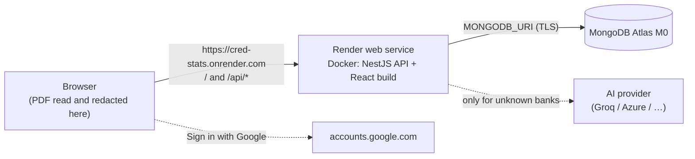

# Deployment — MongoDB Atlas + Render, free tier

The app deploys as **one Docker image on one Render web service**. The NestJS
API serves the built React app from the same origin, so the session cookie is
first-party and nothing sits between the browser and the API. The database is
a free MongoDB Atlas M0 cluster.



Everything below is a one-time setup. After it, every push to `main` deploys.

---

## 1. MongoDB Atlas (≈10 minutes)

1. Sign up at <https://www.mongodb.com/cloud/atlas/register>.
2. **Create a cluster → M0 (Free)**. Provider AWS, region **Singapore**, which
   is the region `render.yaml` pins the web service to — every query the app
   makes crosses that gap, so matching the two is worth more than being near
   you. Mumbai (ap-south-1) works too if you later move the service there.
   Name it `cred-stats`.
3. **Database Access → Add New Database User**: password authentication, a
   generated password, role **Read and write to any database**. Keep the
   username and password for step 5.
4. **Network Access → Add IP Address → Allow access from anywhere**
   (`0.0.0.0/0`). Render's free services have no fixed outbound address, so
   there is no narrower list to give; the database user's password is what
   protects it.
5. **Connect → Drivers → Node.js** and copy the connection string:

   ```
   mongodb+srv://<user>:<password>@cred-stats.xxxxx.mongodb.net/?retryWrites=true&w=majority&appName=cred-stats
   ```

   Replace `<password>`. If it contains `@ : / ? #`, URL-encode them.

The app creates its collections and indexes itself on first start; there is
nothing to run against the cluster.

> Free clusters have 512 MB of storage — thousands of statements, since no PDF
> is ever stored. Atlas may pause or reclaim free clusters that sit unused for a
> long time; check its current policy, and use **Settings → Export** in the app
> now and then.

---

## 2. Google sign-in for the production URL

In your OAuth client ([setup.md §2](setup.md#2-google-sign-in)) add the Render
URL as an **Authorised JavaScript origin**:

```
https://<your-service>.onrender.com
```

The service name, and so the URL, is chosen in the next step (`cred-stats` by
default). You can add the origin after the first deploy — sign-in simply shows
Google's "origin not allowed" error until you do.

While the OAuth consent screen is in _Testing_, only its listed test users can
sign in. **Publish** it when you want anyone with a Google account to be able
to.

---

## 3. Render (≈10 minutes, most of it the first build)

1. Sign up at <https://render.com> with GitHub, and give it access to the
   `credit-stats-visualizer` repository.
2. **New → Blueprint**, pick the repository. Render reads `render.yaml` and
   shows one web service, `cred-stats`: Docker, free plan, Singapore.
3. It asks for the values marked secret:

   | Variable           | Value                                        |
   | ------------------ | -------------------------------------------- |
   | `MONGODB_URI`      | the Atlas string from §1                     |
   | `GOOGLE_CLIENT_ID` | the OAuth client id from §2                  |
   | `GROQ_API_KEY`     | only if you use Groq — leave empty otherwise |

   Everything else `render.yaml` sets itself. `CRED_STATS_SESSION_SECRET` is
   generated by Render — it must be at least 32 characters, so if you ever
   replace it by hand use `openssl rand -base64 32`; shorter and the API
   refuses to start. `MONGODB_DB` defaults to `cred-stats` and only needs
   changing to put several environments in one cluster. To use a model, change
   `LLM_PROVIDER` from `mock` (see [setup.md §3](setup.md#3-ai-provider-optional)
   for the others' variables).

4. **Apply**. The first build takes a few minutes. It is live when the service
   shows **Live** and `https://<service>.onrender.com/api/health` answers
   `"status":"ok"`.
5. Open the site, sign in with Google, upload a statement.

> **If the deploy fails rather than going Live, look at MongoDB first.**
> `/api/health` is the blueprint's health check and it answers 503 until the
> database replies, so Render keeps a deploy that cannot reach Atlas out of
> service instead of publishing a half-working site. That is the right
> behaviour and a confusing symptom: the failure is reported against the
> deploy, not against the database. Almost always it is step 1.4 (Network
> Access still empty) or a `MONGODB_URI` whose password was not URL-encoded.
> `curl https://<service>.onrender.com/api/health` tells the two apart —
> `"database":"unreachable"` is the clue.

A bad value stops the API at boot with a message naming the variable, never the
value, so the logs are safe to paste when asking for help.

### What the free tier means in practice

- **The service sleeps after about 15 minutes without traffic.** The next visit
  wakes it, which takes about a minute; the page waits rather than failing.
- **750 free instance hours a month, per workspace rather than per service** —
  enough for one service running continuously. A second free service in the
  same workspace draws on the same 750, so two of them cannot both stay up all
  month.
- **No persistent disk, and none is needed**: everything lives in Atlas.

---

## 4. After the first deploy

| Task                         | How                                                                      |
| ---------------------------- | ------------------------------------------------------------------------ |
| Deploy a change              | merge to `main` and push — `autoDeploy` builds it                        |
| Watch a deploy               | Render → the service → **Events** / **Logs**                             |
| Roll back                    | Render → **Events** → an earlier deploy → **Rollback**                   |
| Change a setting             | Render → **Environment** → edit → **Save, rebuild and deploy**           |
| Rotate the session secret    | change `CRED_STATS_SESSION_SECRET`; everyone is signed out once          |
| Rotate the database password | Atlas → Database Access → edit user; then update `MONGODB_URI` in Render |
| See who uses the app         | sign in with an admin address → **Admin** in the sidebar                 |

Logs are JSON lines. They never contain statement text, merchant names, emails,
prompts or keys — see [security.md](security.md#logging).

---

## 5. Run the production image locally

The same image, against the local MongoDB:

```bash
export CRED_STATS_SESSION_SECRET="$(openssl rand -base64 32)"
docker compose --profile app up --build     # http://localhost:4000
```

It runs with `NODE_ENV=production`, so there is no demo user: set
`GOOGLE_CLIENT_ID` in `backend/.env` and add `http://localhost:4000` to the
client's origins to sign in.

---

## Other layouts

**Frontend and API as two services** (e.g. the frontend on Render Static Sites
or Netlify, the API on Render) is possible — the folders are independent and
`npm run build -w @cred-stats/frontend` produces a static site. The static host
must **proxy** `/api/*` to the API rather than redirect, so the session cookie
stays first-party; the app sends every request to `/api` on its own origin.
This layout has not been tested end to end; the single service has.
